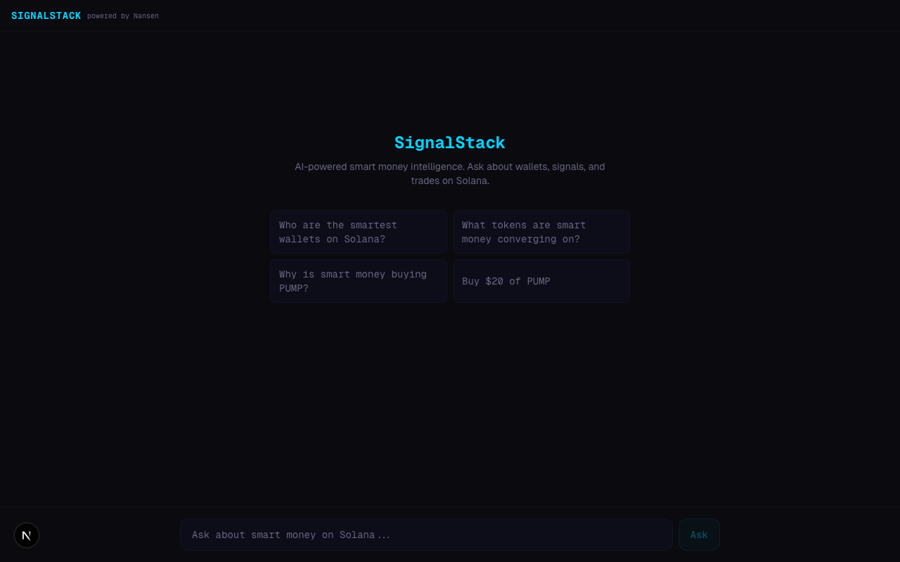
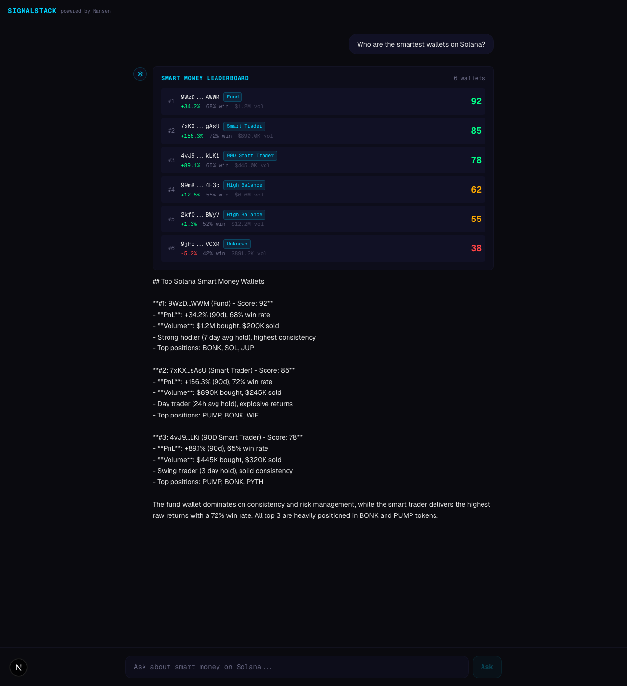
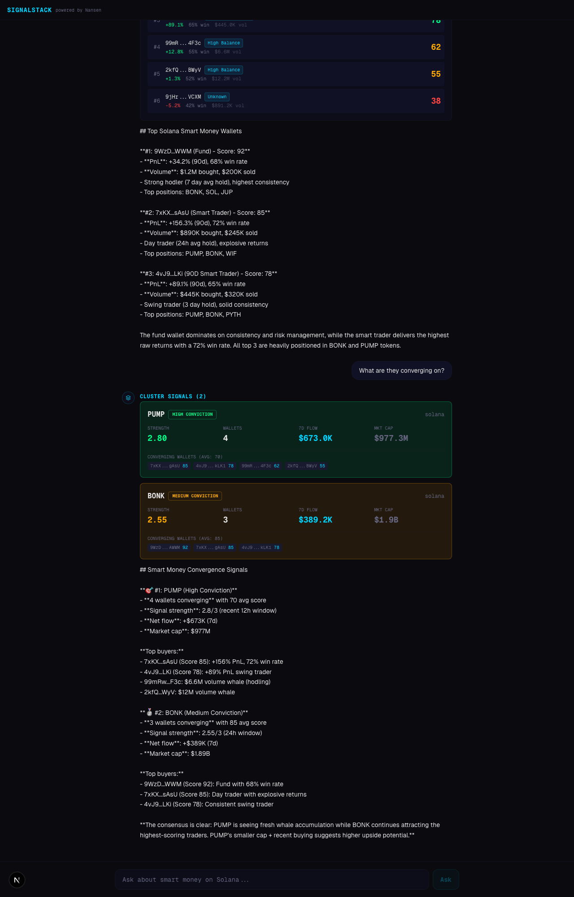

# SignalStack

AI-powered smart money intelligence built on the [Nansen CLI](https://github.com/nansen-ai/nansen-cli).

Ask questions in plain English. SignalStack scores wallets, detects cluster convergence signals, explains why smart money is moving, and can execute trades on Solana.



## How It Works

SignalStack is a conversational AI agent with four specialized tools powered by Nansen's onchain analytics:

**Wallet Scoring** — Pulls smart money netflow data via `nansen-cli`, cross-references wallet activity across top tokens, and computes a composite score based on PnL (40%), win rate (35%), and consistency (25%). Falls back to buy/sell volume ratios when profiler data is unavailable.



**Cluster Detection** — Identifies tokens where 3+ smart money wallets are accumulating within a time window. Calls `smartMoneyNetflow` to find tokens with high trader counts, then `tokenWhoBoughtSold` to get wallet addresses, then scores each wallet via `addressPnlSummary`. Signal strength is computed from wallet count and average score.

**Signal Explanation** — Gathers wallet profiles, volume data, and token metrics to explain WHY smart money is converging on a token. The AI synthesizes a thesis from the raw data.



**Trade Execution** — Quotes DEX swaps on Solana via Nansen's trading API. Maximum $50 per trade with slippage guardrails.

## Architecture

```
User (chat) --> Claude (tool-use)
                 |-- scoreWallets --> nansen-cli smart-money + profiler
                 |-- detectClusters --> netflow convergence analysis
                 |-- explainSignal --> wallet profiles + token metrics
                 |-- executeTrade --> nansen-cli swap (Solana)
```

- **Frontend**: Next.js 16, Tailwind v4, AI SDK v6 (`useChat` + `sendMessage`)
- **AI**: Claude Sonnet 4 with tool-use via `@ai-sdk/anthropic`
- **Data**: Nansen CLI programmatic API (`nansen-cli/src/api.js`) — direct import, no shell-out

## Nansen CLI Integration

SignalStack imports `NansenAPI` directly from `nansen-cli/src/api.js` for programmatic access:

- `smartMoneyNetflow()` — Token-level smart money flows with trader counts
- `tokenWhoBoughtSold()` — Wallet addresses and volumes per token
- `addressPnlSummary()` — Per-wallet PnL, win rate, and trade count
- `getQuote()` / `executeTransaction()` — DEX swap quoting and execution via `nansen-cli/src/trading.js`

All data comes from the live Nansen API. No hardcoded data. No simulations.

## Setup

```bash
# Clone
git clone https://github.com/Dvorson/SignalStack.git
cd SignalStack

# Install
pnpm install

# Configure
cp .env.local.example .env.local
# Add your ANTHROPIC_API_KEY (required)
# Add your NANSEN_API_KEY (required)

# Run
pnpm dev
```

Open http://localhost:3000 and ask:
- "Who are the smartest wallets on Solana?"
- "What tokens are smart money converging on?"
- "Why is smart money buying PUMP?"

## Tech Stack

- [Next.js 16](https://nextjs.org) with Turbopack
- [Tailwind CSS v4](https://tailwindcss.com)
- [AI SDK v6](https://sdk.vercel.ai) with `@ai-sdk/anthropic`
- [Nansen CLI](https://github.com/nansen-ai/nansen-cli) for onchain data
- [Claude Sonnet 4](https://anthropic.com) for reasoning and tool-use
